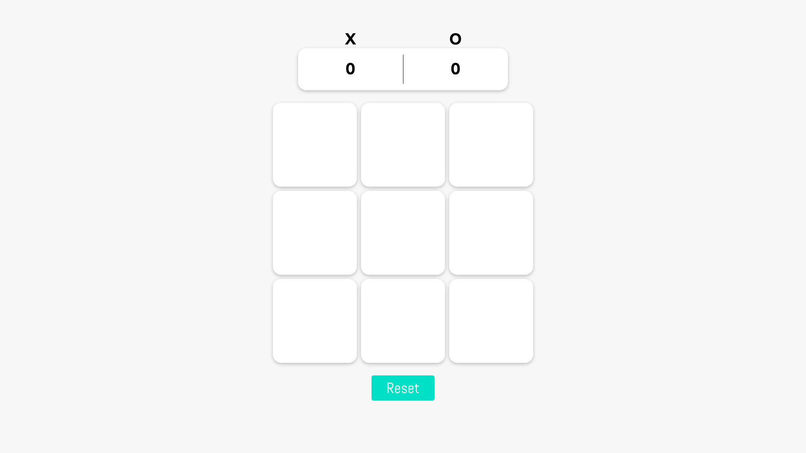
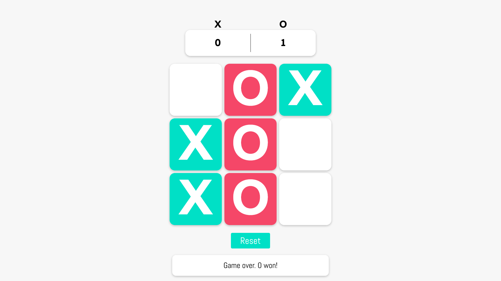
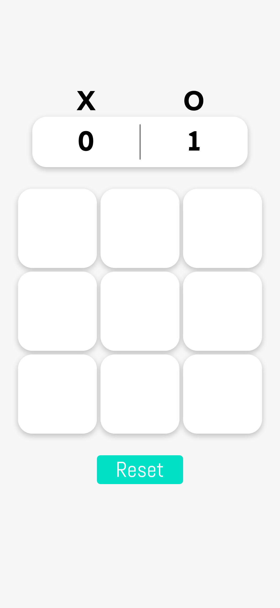
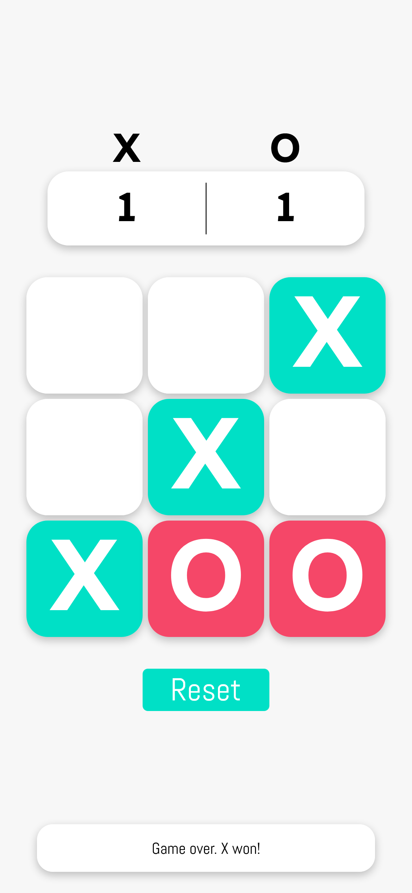

# How to start

Run `npm install` and then `npm start`.
Open [http://localhost:3000](http://localhost:3000) to view it in your browser.

# Live demo

<a href="https://react-tictactoe-game-app.herokuapp.com/" target="_blank">Click here</a>

# Screenhots

  
